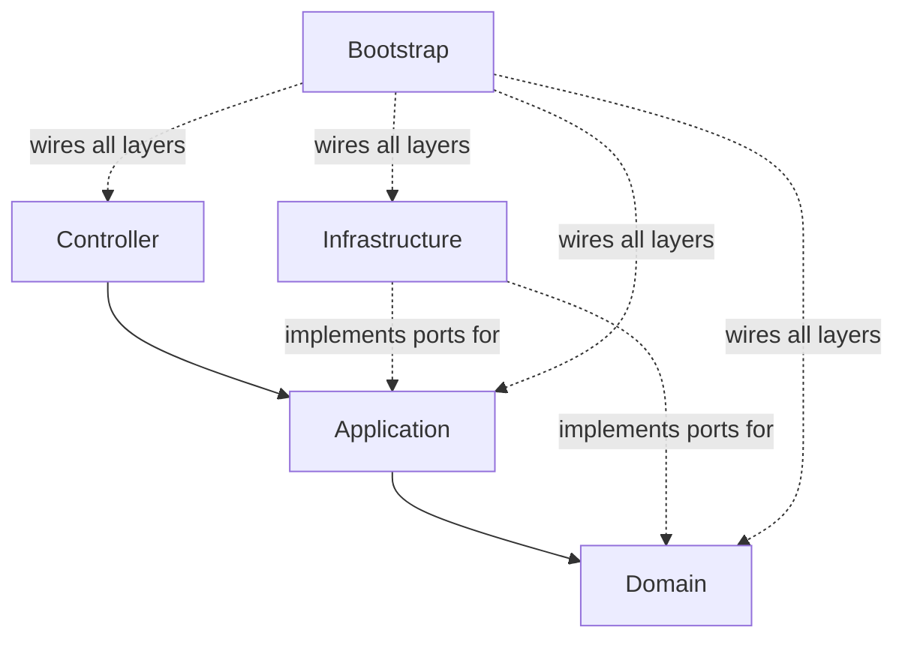
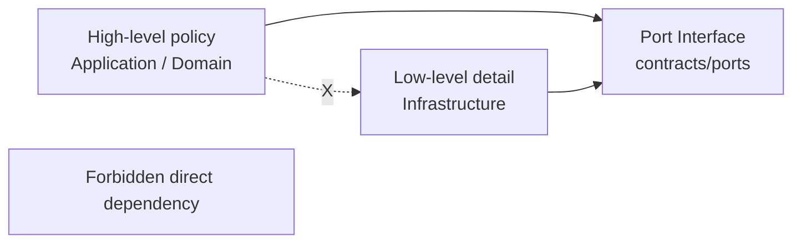

# Flow Decomposition Guide (Open-Source Template)

This guide explains how to take one business flow and decompose it into DDD/CQRS template components.

## 1. Start from a Flow Statement

Write the flow as one sentence:
- Example: `When suspicious login is detected, validate data, persist an audit record, and send alert notifications.`

Then split by intent, not by technical layer:
- Validate input and business constraints
- Execute state/data changes
- Trigger side effects (notification, logging, integration)

## 2. Classify Each Step

For each step, choose one category:
- `Command`: changes state/data
- `Query`: reads data only
- `Domain Rule`: business invariant or policy
- `Side Effect`: notification/external integration

If a step both reads and writes, split into:
1. query/read decision input
2. command/write action

## 3. Map to Template Layers

Use this mapping consistently:
- `Domain`: entities, VOs, enums, domain policies
- `Application`: use-cases, command/query contracts, orchestration
- `Infrastructure`: repositories, db context, logging, external adapters
- `Controller`: API/CLI/Console entry points only
- `Bootstrap`: DI composition and runtime wiring

Rule of thumb:
- Domain should not depend on infrastructure details.
- Application orchestrates; it should not implement persistence mechanics.

### Layer Hierarchy (Top/Bottom)

The template uses this runtime hierarchy (top to bottom):

```text
[Controller]  -> entry (API/CLI/Console)
      |
      v
[Application] -> use-case coordination (commands/queries/workflows)
      |
      v
[Domain]      -> core business model and rules
      ^
      |
[Infrastructure] -> technical implementations via interfaces (db/log/external)

[Bootstrap] -> composition root (wiring only, no business logic)
```

Mermaid view:



### DIP Dependency Direction

DIP means **high-level policy depends on abstractions**, and low-level details implement those abstractions.

```text
Compile-time dependency:
Application/Domain ---> Interface (port contract)
Infrastructure ------> Interface (implements)

Never:
Application/Domain ---> Concrete infrastructure class
```

Mermaid view:



Lint mapping:
- `DIP001`: constructor dependencies in target layers should depend on interfaces.
- `DEP001`/`DEP002`: enforce layer dependency boundaries.
- `MOCK001`: key interfaces should have mock/fake/stub implementations for testability.

## 4. Split Use Cases into Vertical Slices

Create one slice per business intent:
- `application/use-cases/commands/<VerbNounCommand>.cs`
- `application/use-cases/handlers/<VerbNounCommandHandler>.cs`
- `application/use-cases/queries/<VerbNounQuery>.cs`
- `application/use-cases/handlers/<VerbNounQueryHandler>.cs`

Template rule alignment:
- One command file: exactly one `*Command` + one matching handler (`CQRS100`)
- One query file: exactly one `*Query` + one matching handler (`CQRS101`)

## 5. Define Contracts First

Before implementation, define:
- Use-case contracts in `application/contracts/use-cases`
- Port interfaces in `application/contracts/ports`
  - logger, sanitizer, repository contracts if needed

This keeps implementation swappable and testable.

## 6. Design Repository Boundaries

In `infrastructure/database`:
- `abstractions/repository`: interfaces
- `core`: db context/connection factory
- `tables`: persistence models
- `repository`: implementations

Naming convention:
- Repository methods: `Verb + Noun + Async`

Performance checklist after each repository implementation:
- No N+1 query pattern
- No N x M Cartesian explosion
- Query shape reviewed for expected cardinality

## 7. DTO and VO Responsibility

- DTO: built in application layer for transport/IO concerns
- VO: created by service/domain logic, immutable after creation

If data needs correction:
- validate and normalize in normal flow
- do not rely on exception path for expected data fixes

## 8. Error and Exception Policy

- Confirm global middleware catches exceptions
- If middleware catches: do not mutate business data in exception handling
- If middleware does not catch: log error + exception details and fail fast

## 9. Logging and Sanitization Pipeline

Before writing logs:
1. apply sanitization rules pipeline
2. then emit to logger sink (NLog)

Do not bypass sanitizer rules for direct sink writes.

## 10. Linter-Driven Refactoring Loop

For each new flow slice:
1. Implement minimal passing slice
2. Run linter
3. Fix violations by layer responsibility, not by suppressing rules
4. Re-run linter and build

Recommended command:
```powershell
dotnet src/GenericDddLinter/bin/Debug/net10.0/GenericDddLinter.dll src src/GenericDddLinter/linter.policy.sample.json
```

## 10.1 MediatR Validator/Behavior/Middleware Scenarios

In this template, MediatR pipeline behaviors act as request middleware.

- `IRequestValidator<TRequest>` + `ValidationBehavior<TRequest,TResponse>`
  - Use when request shape/constraints must be enforced before use-case execution.
  - Example: required fields, max length, command semantic checks.
- `UnhandledExceptionBehavior<TRequest,TResponse>`
  - Use when you need a centralized fail-fast error log for all requests.
  - Keep data correction out of exception path; only log and rethrow.
- Controller + `ISender`
  - Use when entry points (API/CLI/Console) should dispatch commands/queries uniformly.
  - Keeps controller thin and orchestration in application handlers/use-cases.

## 11. Open-Source Template Contribution Pattern

When adding a feature to the template itself:
1. Add feature files
2. Add/adjust linter rules if architecture contract changes
3. Update docs (`docs/` + skill references)
4. Include one small end-to-end example slice
5. Keep defaults conservative and extensible

## 12. Quick Decomposition Checklist

- [ ] Flow sentence written
- [ ] Steps classified (Command/Query/Rule/Side effect)
- [ ] Use-case contracts defined
- [ ] CQRS files and handlers created
- [ ] Repository shape reviewed for N+1 and N x M
- [ ] DTO/VO responsibilities respected
- [ ] Logging goes through sanitization
- [ ] Linter clean
- [ ] Build clean
