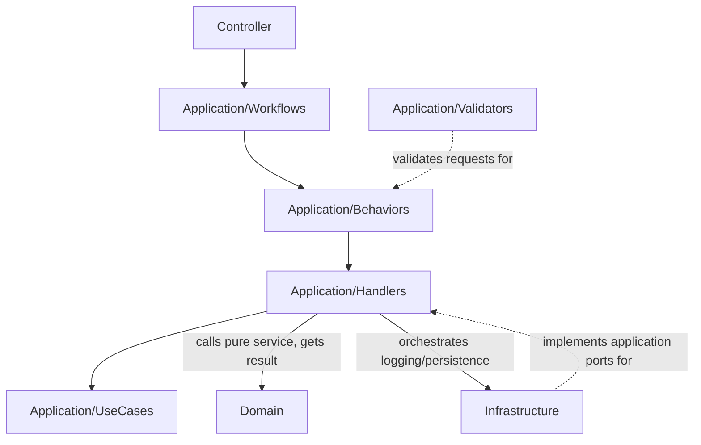

# Flow Decomposition Guide

This is the **process guide** (how to think and split a flow).
For rule contracts, see `docs/CONVENTIONS.md`.

## 1. Write One Flow Sentence
Example:
- `When suspicious login is detected, validate input, persist an audit record, and send notifications.`

## 2. Classify Steps
- `Command`: writes state/data
- `Query`: reads only
- `Domain Rule`: invariant/policy
- `Side Effect`: external integration

If a step both reads and writes, split into `Query` then `Command`.

## 3. Apply the Slice Shape
For each business flow, create:
- `domain/services/<Business>ExecutionService.cs` (pure domain logic; returns a result VO, no logging/persistence)
- `domain/value-objects/<Business>ResultVo.cs` (immutable result returned to the application)
- `application/use-cases/<Business>BusinessUseCase.cs` (record contracts only)
- `application/handlers/<Business>BusinessUseCase.<Request>Handler.cs` (orchestration: call the domain service, then log/persist based on the result)
- `application/validators/<Business><Request>Validator.cs` (optional)
- `application/workflows/<Business>Workflow.cs` (dispatch only)
- `application/behaviors/*Behavior.cs` only when a new cross-cutting concern is required.

Notes:
- Naming/contract details are lint-governed (`CQRS100/101/102`), not duplicated here.
- `*Service` classes must live under `domain/services/` (`PATH006`).
- Domain services never log or decide persistence; they return a result and the handler orchestrates side effects.

## 4. Keep the State/Data Rule
At boundaries, prefer producing next values instead of mutating shared state.
- Good: `next = transform(current)`
- Avoid: boundary-crossing mutable updates

## 5. Runtime Flow (Diagram)


Note: domain services return a result value object. The handler owns logging and the
persist/skip decision. Infrastructure-internal abstractions (e.g. sanitizers) live in
infrastructure next to their implementations, not in `application/contracts`.

## 6. Verify with Tooling
1. Run linter.
2. Fix violations.
3. Build.

```powershell
dotnet src/GenericDddLinter/bin/Debug/net10.0/GenericDddLinter.dll src src/GenericDddLinter/linter.policy.sample.json
dotnet build DddLinterSkillKit.slnx
```

## 7. Use the Existing End-to-End Sample
Use the canonical sample list:
- `docs/SAMPLE_VERTICAL_SLICE.md`
